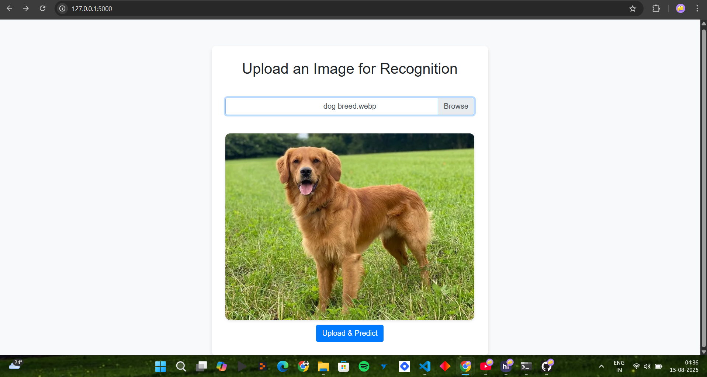
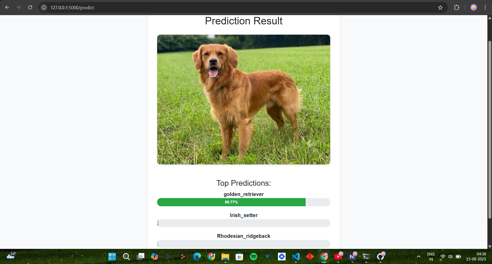

# 🖼️ Image Recognition System

A simple yet powerful **Image Recognition Web App** built with **Flask** and **MobileNetV2**.  
Upload any image, and the app will identify the top 3 possible objects in it with confidence scores.

---

## 🚀 Features
- 📂 Upload any image (JPG, PNG, JPEG)
- 🤖 Uses **MobileNetV2** pre-trained on ImageNet dataset
- 📊 Displays top 3 predictions with accuracy percentage
- 🌐 Simple and user-friendly web interface

---

## 📸 Demo
### Upload Page


### Prediction Result



---

## 🛠️ Installation & Setup

### 1️⃣ Clone the repository
```bash
git clone https://github.com/Zyashi/image-recognition-system.git
cd image-recognition-system

